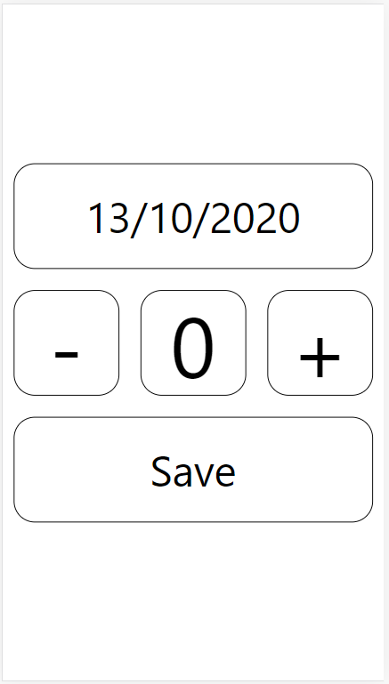
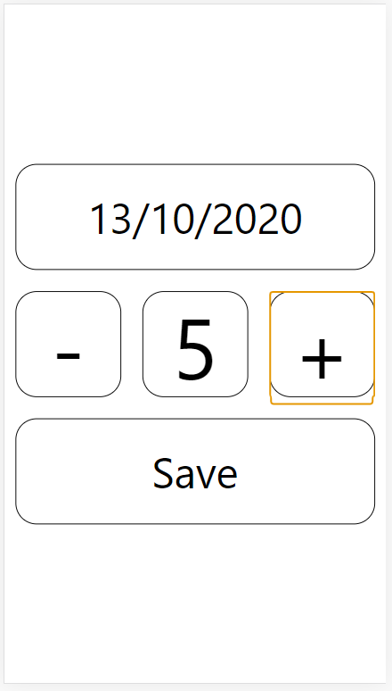

<h1>Achoos Counter</h1>

  Achoos Counter es una app en fase de desarrollo hecha usando React Native y Expo, ya que fue pensada para Mobile, cuya funcionlidad es contar el número de estornudos. 
  Se me ocurrió crearla porque soy de sufrir ataques espontáneos de alergias, en los que estornudo hasta aproximadamente 10 veces. 
  La idea es guardar un registro, por día, de cuantas veces estornudó el usuario.
  Para guardar los registros se hace uso de una API hecha en Firestore: <a href="https://github.com/andresguastavino/AchoosCounterAPI">AchoosCounterAPI</a>, la cual guarda por id de usuario el número de estornudos por fecha.
  Actualmente sólo cuenta con una pantalla, pero tengo pensado agregarle un calendario para facilitar el acceso y navegación entre las fechas.

Adjunto imágenes de la misma:

